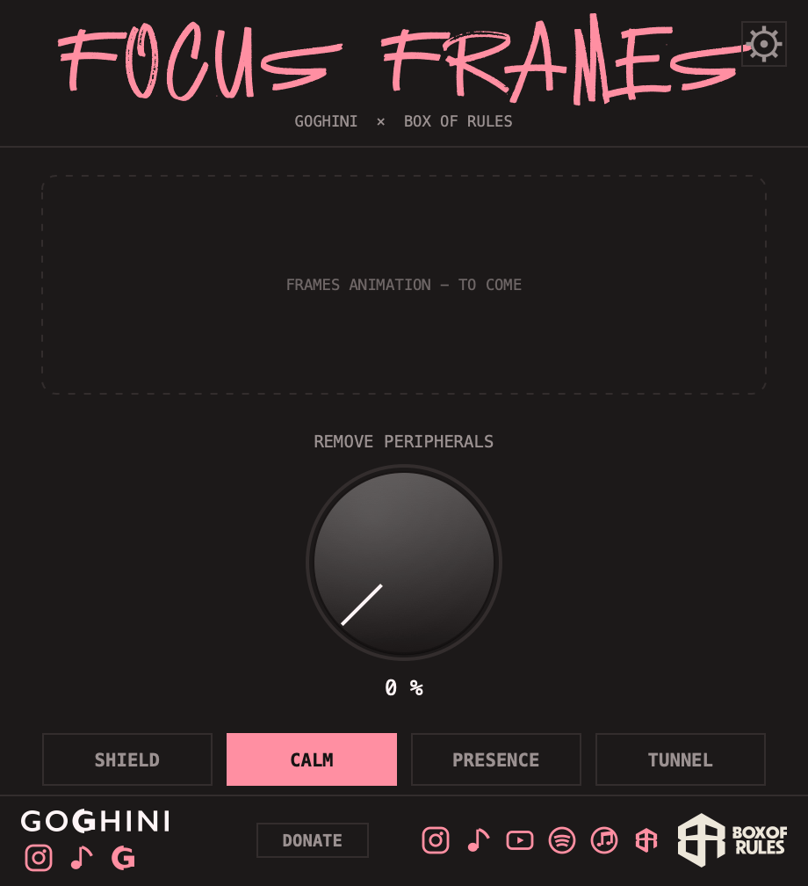

# Focus Frames

**Remove the peripherals — free.** AU / VST3 / LV2 for macOS, Windows and Linux. Stereo only, by design.

**⬇️ [Download the latest release](https://github.com/boxofrules/focus-frames/releases/latest)** · **[Full plugin page, docs and FAQ](https://boxofrules.com/plugins/focus-frames?utm_source=github&utm_medium=readme&utm_campaign=focus-frames)**

[Focus Frames™](https://goghini.com?utm_source=github&utm_medium=readme&utm_campaign=focus-frames) are Goghini's peripheral-blocking glasses: side shields quiet the visual noise at the edges so your attention stays on what's in front of you. This plugin — a Goghini × Box of Rules collaboration — does the same to a stereo bus. One dial, REMOVE PERIPHERALS: as it turns, the sides close in and the mono middle comes forward. A hypermono-niser.

Four ways of closing the shields: **SHIELD** (pure side attenuation, surgical), **CALM** (the image narrows but the loudness stays — slow RMS make-up, the default), **PRESENCE** (the middle comes forward: presence lift and gentle saturation on the mid), **TUNNEL** (frequency-dependent — lows fold to mono first, highs last; 100 % is exactly mono). The mid is untouched in SHIELD, CALM and TUNNEL, so your mix's mono fold-down never changes character — only the width does. Zero latency: safe for tracking.

## About this repository

This repository hosts **releases only** — the plugin's source is developed privately. The released binaries are free to download and use, including on commercial productions. See each release's notes for what's new, and [boxofrules.com/privacy](https://boxofrules.com/privacy?utm_source=github&utm_medium=readme&utm_campaign=focus-frames) for the honest answer to "does it phone home?" (anonymous usage counts, clearly-labelled opt-out checkbox in the plugin's SYS panel).

© 2026 Box of Rules. Goghini, the G monogram and Focus Frames™ are trademarks of Goghini, used with permission. Binaries provided "as is", no warranty. [boxofrules.com](https://boxofrules.com/?utm_source=github&utm_medium=readme&utm_campaign=focus-frames) · [goghini.com](https://goghini.com?utm_source=github&utm_medium=readme&utm_campaign=focus-frames)
